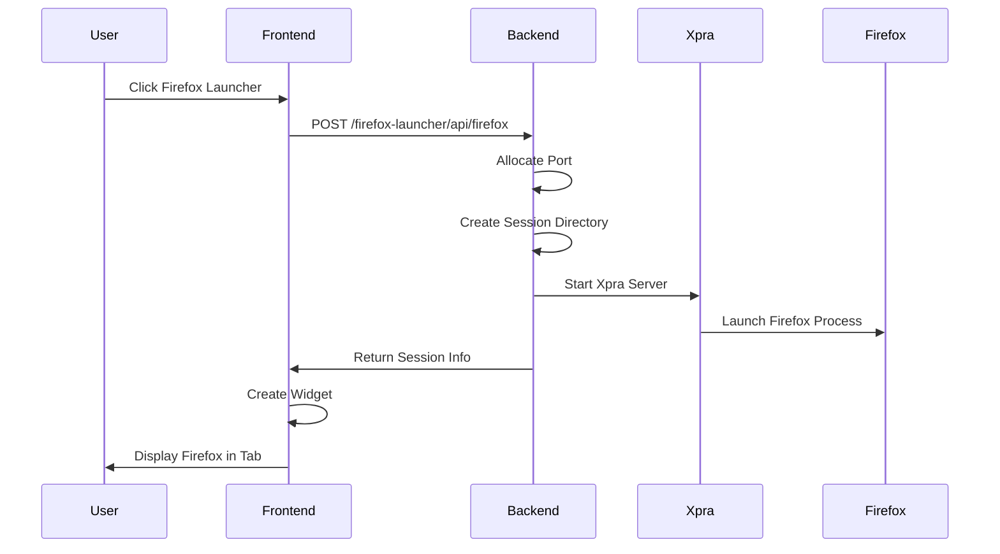
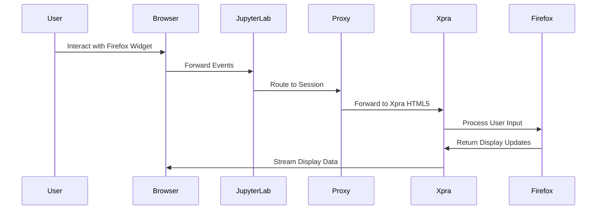
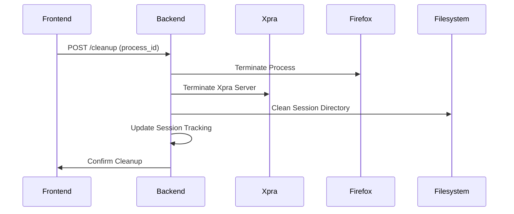

---
# Copyright (c) 2025 Vantage Compute Corporation.
layout: page
title: Architecture
permalink: /architecture/
---

# Architecture

The JupyterLab Firefox Launcher is built on a multi-tier architecture that seamlessly integrates Firefox browser capabilities into the JupyterLab environment. This document provides a comprehensive overview of the system architecture, component interactions, and data flow.

## System Overview

The extension consists of several interconnected components that work together to provide seamless Firefox integration:

```
┌─────────────────┐    ┌──────────────────┐    ┌─────────────────┐
│   JupyterLab    │    │   Server-Side    │    │     Firefox     │
│   Frontend      │    │    Extension     │    │    Process      │
│                 │    │                  │    │                 │
│ ┌─────────────┐ │    │ ┌──────────────┐ │    │ ┌─────────────┐ │
│ │   Widget    │◄┼────┼─│   Handler    │ │    │ │   Browser   │ │
│ │             │ │    │ │              │ │    │ │   Instance  │ │
│ └─────────────┘ │    │ └──────────────┘ │    │ └─────────────┘ │
│ ┌─────────────┐ │    │ ┌──────────────┐ │    │ ┌─────────────┐ │
│ │  Launcher   │ │    │ │   Xpra CMD   │◄┼────┼─│    Xpra     │ │
│ │   Button    │ │    │ │   Builder    │ │    │ │   Server    │ │
│ └─────────────┘ │    │ └──────────────┘ │    │ └─────────────┘ │
└─────────────────┘    └──────────────────┘    └─────────────────┘
        │                        │                        │
        │                        │                        │
        └────────── HTTP API ────┼──── unix/tcp sockets ──┘
                                 │
                    ┌──────────────────┐
                    │   Session        │
                    │   Management     │
                    │                  │
                    │ ┌──────────────┐ │
                    │ │   Profile    │ │
                    │ │   Isolation  │ │
                    │ └──────────────┘ │
                    └──────────────────┘
```

## Component Architecture

### Frontend Layer

#### 1. JupyterLab Widget System
The frontend is built using JupyterLab's widget system, providing native integration with the JupyterLab interface.

**Key Components:**
- **Firefox Widget**: Main widget that displays Firefox content
- **Launcher Integration**: Button integration in JupyterLab launcher
- **Lifecycle Management**: Handles widget creation, disposal, and cleanup

**Widget Lifecycle:**
```typescript
Widget Creation → Session Request → Process Tracking → Display → Cleanup
```

#### 2. Communication Layer
The frontend communicates with the backend through RESTful APIs:

**API Endpoints:**
- `POST /firefox-launcher/api/firefox` - Launch new session
- `GET /firefox-launcher/api/firefox` - Session status and redirect
- `POST /firefox-launcher/api/cleanup` - Session cleanup
- `HEAD /firefox-launcher/api/firefox` - Session availability check

### Backend Layer

#### 1. Server Extension (`server_extension.py`)
Registers HTTP handlers with the Jupyter server and manages the extension lifecycle.

**Responsibilities:**
- Handler registration and routing
- Extension configuration management
- Integration with Jupyter server lifecycle

#### 2. Firefox Handler (`firefox_handler.py`)
Core backend component that manages Firefox sessions and processes.

**Key Features:**
- Multi-session management
- Process lifecycle control
- Session isolation
- Resource cleanup
- Error handling and logging

**Session Management Flow:**
```python
Session Request → Port Allocation → Directory Creation → 
Process Launch → Proxy Setup → Session Tracking
```

#### 3. Cleanup Handler
Specialized handler for session cleanup and resource management.

**Cleanup Types:**
- **Automatic**: Triggered by frontend lifecycle events
- **Manual**: User-initiated cleanup
- **Batch**: Multiple session cleanup
- **Emergency**: Nuclear cleanup for stuck processes

### System Layer

#### 1. Xpra Remote Display Server
Xpra provides high-performance remote display capabilities for Firefox sessions.

**Xpra Configuration:**
- TCP binding for web access
- HTML5 client support
- Session-specific display management
- Clipboard integration
- Performance optimization

**Xpra Command Structure:**
```bash
xpra start --bind-tcp=0.0.0.0:PORT --html=on --daemon=no 
     --start-child=firefox-xstartup --session-name=Firefox-Session-PORT
```

#### 2. Firefox Process Management
Each Firefox session runs as an independent process with isolated resources.

**Process Architecture:**
```
Xpra Server (Parent)
└── Firefox Process (Child)
    ├── Session Directory
    ├── Profile Directory  
    ├── Cache Directory
    └── Runtime Directory
```

#### 3. Session Isolation System
Complete isolation between sessions using dedicated directory structures.

**Session Directory Structure:**
```
~/.firefox-launcher/sessions/session-{port}/
├── profile/          # Firefox profile data
├── cache/           # Browser cache
├── temp/            # Temporary files
├── runtime/         # X11 and runtime files
└── sockets/         # IPC sockets
```

## Data Flow

### 1. Session Creation Flow



### 2. User Interaction Flow



### 3. Cleanup Flow



## Security Architecture

### 1. Session Isolation
Each Firefox session is completely isolated from others:

**Process Isolation:**
- Separate system processes
- Independent memory spaces
- Isolated file systems
- Dedicated network namespaces

**Data Isolation:**
- Session-specific directories
- Independent Firefox profiles
- Separate cache and temporary files
- Isolated runtime environments

### 2. Access Control
Multiple layers of access control ensure security:

**Authentication:**
- JupyterLab authentication required
- XSRF protection for user actions
- Session-specific access tokens

**Authorization:**
- User can only access their own sessions
- Process ownership validation
- Directory permission controls

### 3. Resource Management
Proper resource management prevents abuse:

**Resource Limits:**
- Memory usage monitoring
- Process count limitations
- Session timeout controls
- Automatic cleanup mechanisms

## Performance Architecture

### 1. Display Optimization
Xpra provides optimized remote display performance:

**Compression:**
- Configurable compression algorithms
- Adaptive quality adjustment
- Bandwidth optimization
- Frame rate control

**Caching:**
- Client-side display caching
- Partial screen updates
- Mouse cursor optimization
- Clipboard synchronization

### 2. Resource Efficiency
Efficient resource usage across all components:

**Memory Management:**
- Session-specific memory allocation
- Garbage collection optimization
- Resource pooling where applicable
- Automatic cleanup mechanisms

**Process Management:**
- Minimal process overhead
- Efficient process communication
- Resource sharing optimization
- Graceful process termination

## Scalability Considerations

### 1. Multi-User Support
The architecture supports multiple concurrent users:

**User Isolation:**
- Per-user session directories
- Independent process trees
- Isolated resource allocation
- User-specific cleanup

### 2. Resource Scaling
The system can scale based on resource availability:

**Horizontal Scaling:**
- Multiple JupyterLab instances
- Load balancing support
- Distributed session management
- Cross-instance cleanup

**Vertical Scaling:**
- Memory usage optimization
- CPU usage monitoring
- Storage management
- Network bandwidth control

## Error Handling Architecture

### 1. Fault Tolerance
Robust error handling at all levels:

**Process Failures:**
- Automatic process restart
- Graceful degradation
- Error logging and monitoring
- User notification systems

**Network Failures:**
- Connection retry mechanisms
- Timeout handling
- Fallback strategies
- State recovery

### 2. Monitoring and Logging
Comprehensive monitoring and logging:

**System Monitoring:**
- Process health checks
- Resource usage monitoring
- Performance metrics
- Error rate tracking

**Logging Strategy:**
- Structured logging format
- Multiple log levels
- Debug mode support
- Log rotation and cleanup

## Next Steps

- **[Installation Guide]({{ site.baseurl }}/installation)**: Learn how to install and configure the extension
- **[Development Guide]({{ site.baseurl }}/development)**: Set up a development environment
- **[API Reference]({{ site.baseurl }}/api-reference)**: Detailed API documentation
- **[Troubleshooting]({{ site.baseurl }}/troubleshooting)**: Common issues and solutions
