---
# Copyright (c) 2025 Vantage Compute Corporation.
layout: page
title: Development Guide
permalink: /development/
---

# Development Guide

This comprehensive guide covers everything you need to know about developing with and contributing to the JupyterLab Firefox Launcher extension.


## Build Infrastructure, Flow, and Tooling

### Build Pipeline Overview

The JupyterLab Firefox Launcher uses a sophisticated multi-stage build pipeline that coordinates both frontend (TypeScript/JavaScript) and backend (Python) components into a single distributable package.


### Build Toolchain Components

#### 1. **Entry Point: `build.sh`**
```bash
#!/bin/bash
# Copyright (c) 2025 Vantage Compute Corporation.

rm -rf jupyterlab_firefox_launcher/labextension/static
rm -rf jupyterlab_firefox_launcher/labextension/package.json
rm -rf lib/
rm -rf dist/

uv build --wheel --no-cache --verbose
```

**Purpose:**
- **Cleanup**: Removes stale build artifacts
- **Orchestration**: Triggers the main build process
- **Reproducibility**: Ensures clean builds without cached dependencies

#### 2. **Package Manager: `uv build`**
```bash
uv build --wheel --no-cache --verbose
```

**Purpose:**
- **Fast Dependency Resolution**: Uses Rust-based resolver for speed
- **Wheel Creation**: Generates Python wheel distribution format
- **Cache Management**: `--no-cache` ensures fresh dependency resolution
- **Visibility**: `--verbose` provides detailed build output for debugging

#### 3. **Build Backend: `hatchling`**
```toml
[build-system]
requires = [
    "hatchling>=1.5.0",
    "jupyterlab>=4.0.0,<5",
    "hatch-jupyter-builder>=0.8.3"
]
build-backend = "hatchling.build"
```

**Purpose:**
- **PEP 517 Compliance**: Modern Python build system
- **Metadata Management**: Handles package metadata and dependencies
- **Build Coordination**: Orchestrates the overall build process
- **Hook Integration**: Provides hooks for custom build steps

#### 4. **JupyterLab Integration: `hatch-jupyter-builder`**
```toml
[tool.hatch.build.hooks.jupyter-builder]
dependencies = ["hatch-jupyter-builder>=0.8.3"]
build-function = "hatch_jupyter_builder.npm_builder"
ensured-targets = [
    "jupyterlab_firefox_launcher/labextension/static/style.js",
    "jupyterlab_firefox_launcher/labextension/package.json",
]
```

**Purpose:**
- **Dual Build Coordination**: Manages both Python and JavaScript builds
- **Asset Management**: Ensures frontend assets are built and included
- **Target Validation**: Verifies required build artifacts exist
- **JupyterLab Standards**: Follows JupyterLab extension conventions

### Detailed Build Flow

#### Phase 1: Cleanup & Preparation


#### Phase 2: Frontend Build Pipeline


#### Phase 3: Backend Build Pipeline

```mermaid
graph TD
    A[hatchling coordination] --> B[Python Source Processing]
    
    B --> C[jupyterlab_firefox_launcher/__init__.py]
    B --> D[jupyterlab_firefox_launcher/server_extension.py]
    B --> E[jupyterlab_firefox_launcher/firefox_handler.py]
    B --> F[jupyterlab_firefox_launcher/session_cleanup.py]
    B --> G[jupyterlab_firefox_launcher/server_proxy.py]
    B --> H[jupyterlab_firefox_launcher/_version.py]
    
    C --> I[Package Assembly]
    D --> I
    E --> I
    F --> I
    G --> I
    H --> I
    
    I --> J[Script Installation Mapping]
    J --> K[scripts/firefox-xstartup → bin/firefox-xstartup]
    
    K --> L[Jupyter Configuration]
    L --> M[jupyter-config/ → etc/jupyter/]
    
    M --> N[Metadata Generation]
    N --> O[Dependency Resolution]
    
    style A fill:#e8f5e8
    style O fill:#ffebee
```


#### Phase 4: Package Assembly


### Build Configuration Files

#### **pyproject.toml** - Master Build Configuration
```toml
[tool.hatch.build.targets.wheel.shared-data]
"scripts/firefox-xstartup" = "bin/firefox-xstartup"
"jupyter-config" = "etc/jupyter"

[tool.hatch.build.hooks.jupyter-builder]
dependencies = ["hatch-jupyter-builder>=0.8.3"]
build-function = "hatch_jupyter_builder.npm_builder"
ensured-targets = [
    "jupyterlab_firefox_launcher/labextension/static/style.js",
    "jupyterlab_firefox_launcher/labextension/package.json",
]
skip-if-exists = [
    "jupyterlab_firefox_launcher/labextension/static/style.js",
    "jupyterlab_firefox_launcher/labextension/package.json",
]
```

#### **package.json** - Frontend Build Configuration
```json
{
  "scripts": {
    "build": "jlpm build:lib && jlpm build:labextension:dev",
    "build:prod": "jlpm clean && jlpm build:lib:prod && jlpm build:labextension",
    "build:labextension": "jupyter labextension build .",
    "build:labextension:dev": "jupyter labextension build --development True .",
    "build:lib": "tsc --sourceMap",
    "build:lib:prod": "tsc"
  }
}
```

#### **tsconfig.json** - TypeScript Build Configuration
```json
{
  "compilerOptions": {
    "target": "es2018",
    "lib": ["es2018", "dom"],
    "module": "esnext",
    "moduleResolution": "node",
    "outDir": "./lib",
    "strict": true
  },
  "include": ["src/**/*"]
}
```

### Build Artifacts & Outputs

#### **Generated Directory Structure**
```
dist/
└── jupyterlab_firefox_launcher-0.1.0-py3-none-any.whl
    ├── jupyterlab_firefox_launcher/
    │   ├── __init__.py
    │   ├── server_extension.py
    │   ├── firefox_handler.py
    │   └── labextension/
    │       ├── package.json
    │       └── static/
    │           ├── style.js
    │           ├── remoteEntry.*.js
    │           └── *.svg
    ├── bin/
    │   └── firefox-xstartup
    └── etc/
        └── jupyter/
            └── jupyter_server_config.d/
                └── jupyterlab_firefox_launcher.json
```

### Build Validation & Quality Checks

#### **Asset Verification**

```mermaid
graph LR
    A[Build Completion] --> B[Check labextension/static/style.js]
    B --> C[Check labextension/package.json]
    C --> D[Validate Python Package Structure]
    D --> E[Verify Script Installation Paths]
    E --> F[Test Import Statements]
    F --> G[Build Success ✓]
    
    B --> H[Build Failure ✗]
    C --> H
    D --> H
    E --> H
    F --> H
    
    style G fill:#c8e6c9
    style H fill:#ffcdd2
```


### Development vs Production Builds

#### **Development Build Flow**
```bash
# Development setup
jupyter labextension develop . --overwrite
jupyter lab --watch  # Auto-rebuild on changes
```

#### **Production Build Flow**
```bash
# Production build
./build.sh  # Clean, optimized build
```

### Troubleshooting Build Issues

#### **Common Build Problems**


This comprehensive build pipeline ensures that both frontend TypeScript code and backend Python code are properly compiled, bundled, and packaged into a single wheel file that can be easily installed and distributed.


## Development Setup

### Prerequisites

Before starting development, ensure you have the required tools installed:

- **Python**: 3.10+ (3.11+ recommended)
- **Node.js**: 16+ (18+ recommended) 
- **uv**: Fast Python package manager (recommended)
- **Git**: Version control
- **System packages**: Xpra, Firefox, Xvfb (see [Dependencies]({{ site.baseurl }}/dependencies))

### Quick Development Setup

```bash
# Clone the repository
git clone https://github.com/vantagecompute/jupyterlab-firefox-launcher.git
cd jupyterlab-firefox-launcher

# Install development dependencies
uv pip install -e ".[dev]"

# Install frontend dependencies
uv run jlpm install

# Enable development mode
uv run jupyter labextension develop . --overwrite

# Start development server with watch mode
uv run jupyter lab --watch
```

### Detailed Setup Process

#### 1. Environment Setup

**Option A: Using uv (Recommended)**
```bash
# Create virtual environment
uv venv
source .venv/bin/activate  # Linux/Mac
# dev-env\Scripts\activate  # Windows

# Install development dependencies
uv pip install -e ".[dev]"
```

**Option B: Using pip**
```bash
# Create virtual environment
python -m venv .venv
source .venv/bin/activate

# Upgrade pip and install dependencies
pip install --upgrade pip
pip install -e ".[dev]"
```

**Option C: Using conda**
```bash
# Create conda environment
conda create -n firefox-launcher-dev python=3.11
conda activate firefox-launcher-dev

# Install dependencies
pip install -e ".[dev]"
```

#### 2. Frontend Development Setup

```bash
# Install Node.js dependencies
jlpm install

# Enable development mode in JupyterLab
jupyter labextension develop . --overwrite

# Verify installation
jupyter labextension list | grep firefox-launcher
```

## Development Workflow

### Project Structure

Understanding the project structure is crucial for effective development:

```
jupyterlab-firefox-launcher/
├── src/                          # TypeScript source files
│   ├── index.ts                 # Main extension entry point
│   ├── firefox-api.ts          # Firefox session API client
│   └── svg.d.ts                 # SVG type declarations
├── style/                        # CSS and styling
│   ├── index.css               # Main stylesheet
│   └── icons/                   # Icon assets
│       └── firefox.svg         # Firefox icon
├── jupyterlab_firefox_launcher/  # Python package
│   ├── __init__.py             # Package initialization and entry points
│   ├── _version.py             # Version management using importlib.metadata
│   ├── server_extension.py     # Jupyter server extension registration
│   ├── firefox_handler.py      # Core session management and Xpra integration
│   ├── server_proxy.py         # jupyter-server-proxy integration
│   ├── session_cleanup.py      # Automatic session cleanup and registry
│   └── labextension/           # Built frontend assets
│       ├── package.json        # Frontend package metadata
│       └── static/             # Compiled JavaScript and assets
├── scripts/                      # Executable scripts
│   └── firefox-xstartup        # Firefox startup wrapper script
├── bin/                          # Script installation directory
│   └── firefox-xstartup        # Installed Firefox wrapper
├── tests/                        # Test suite
├── docs/                         # Documentation site
├── jupyter-config/              # Jupyter configuration
│   └── jupyter_server_config.d/ # Server extension config
├── lib/                          # Compiled TypeScript output
├── pyproject.toml               # Python project configuration
├── package.json                 # NPM package configuration
├── tsconfig.json               # TypeScript configuration
└── build.sh                    # Production build script
```

### Development Commands

#### Frontend Development

```bash
# Start JupyterLab in watch mode (rebuilds on changes)
jupyter lab --watch

# Manual build during development
jlpm build

# Clean build artifacts
jlpm clean

# Type checking
jlpm run check

# Linting
jlpm run eslint
```

#### Backend Development

```bash
# Run Python tests
pytest

# Run tests with coverage
pytest --cov=jupyterlab_firefox_launcher

# Type checking
mypy jupyterlab_firefox_launcher/

# Code formatting
black jupyterlab_firefox_launcher/
isort jupyterlab_firefox_launcher/

# Linting
flake8 jupyterlab_firefox_launcher/
```

#### Full Build Process

The `build.sh` script provides a complete production build:

```bash
#!/bin/bash

# Clean previous build artifacts
rm -rf jupyterlab_firefox_launcher/labextension/static
rm -rf jupyterlab_firefox_launcher/labextension/package.json
rm -rf lib/
rm -rf dist/

# Build wheel package with verbose output and no cache
uv build --wheel --no-cache --verbose
```

**Build Process Breakdown:**

1. **Cleanup Phase**: Removes previous build artifacts
   - `labextension/static/`: Compiled frontend assets
   - `labextension/package.json`: Frontend package metadata
   - `lib/`: TypeScript compilation output
   - `dist/`: Python wheel distribution

2. **Build Phase**: Uses `uv build` for fast, reliable package building
   - `--wheel`: Creates wheel distribution format
   - `--no-cache`: Ensures fresh build without cached dependencies
   - `--verbose`: Provides detailed build output for debugging

**Manual Build Steps:**
```bash
# Frontend build
jlpm install                     # Install Node.js dependencies
jlpm build:prod                 # Build and bundle frontend code

# Backend build  
python -m build --wheel         # Build Python wheel package

# Development installation
uv pip install -e .            # Install in development mode
```

### Code Organization

#### Frontend Code (`src/`)

**Main Extension (`src/index.ts`)**
- Widget creation and management
- JupyterLab integration
- Lifecycle management
- Event handling

**Key Classes and Functions:**
```typescript
// Main widget class
class FirefoxWidget extends Widget {
  constructor(port: number, processId: number) {
    // Widget initialization
  }
  
  dispose(): void {
    // Cleanup logic
  }
}

// Extension activation
function activate(app: JupyterFrontEnd): void {
  // Extension setup and registration
}
```

#### Python Package (`jupyterlab_firefox_launcher/`)

**Package Initialization (`__init__.py`)**
- Package entry points for Jupyter server extension discovery
- Version management and module exports
- Extension metadata and configuration

**Version Management (`_version.py`)**
- Dynamic version detection using `importlib.metadata`
- Fallback version for development installations
- Single source of truth for package version

**Server Extension (`server_extension.py`)**
- Handler registration with Jupyter server
- URL routing configuration
- Extension lifecycle management
- Integration with jupyter-server-proxy

**Firefox Handler (`firefox_handler.py`)**
- Core session management logic
- Xpra server integration and command generation
- Process lifecycle management (start, monitor, cleanup)
- Multi-session support with port allocation
- Session data persistence and retrieval

**Server Proxy Integration (`server_proxy.py`)**
- jupyter-server-proxy entry point configuration
- Proxy setup for Xpra HTML5 client access
- URL mapping and routing

**Session Cleanup (`session_cleanup.py`)**
- Centralized session registry for tracking active sessions
- Automatic cleanup on server shutdown
- Process monitoring and zombie process detection
- Resource cleanup (session directories, temp files)
- Thread-safe session management

### Testing

#### Running Tests

```bash
# Run all Python tests
pytest

# Run specific test file
pytest tests/test_firefox_handler.py

# Run with verbose output
pytest -v

# Run with coverage reporting
pytest --cov=jupyterlab_firefox_launcher --cov-report=html

# Run integration tests
python tests/test_integration.py
```

#### Writing Tests

**Unit Test Example:**
```python
import pytest
from jupyterlab_firefox_launcher.firefox_handler import _find_free_port

def test_find_free_port():
    """Test port allocation functionality."""
    port = _find_free_port()
    assert isinstance(port, int)
    assert 1024 < port < 65535

@pytest.mark.asyncio
async def test_firefox_handler_post():
    """Test Firefox handler POST request."""
    # Test implementation
    pass
```

**Integration Test Example:**
```python
def test_full_workflow():
    """Test complete Firefox launch workflow."""
    # Start JupyterLab server
    # Make API request
    # Verify Firefox process
    # Clean up
    pass
```

#### Frontend Testing

```bash
# Run Jest tests
jlpm test

# Run tests in watch mode
jlpm test --watch

# Generate coverage report
jlpm test --coverage
```

### Debugging

#### Backend Debugging

**Enable Debug Logging:**
```python
import logging
logging.basicConfig(level=logging.DEBUG)

# Or set environment variable
export FIREFOX_LAUNCHER_DEBUG=1
```

**Debug Session Management:**
```python
# In firefox_handler.py
_logger.debug(f"Active sessions: {FirefoxLauncherHandler._active_sessions}")
_logger.debug(f"Process ID: {process.pid}, Port: {port}")
```

**Process Debugging:**
```bash
# Monitor processes
ps aux | grep -E "(xpra|firefox)"

# Check session directories
ls -la ~/.firefox-launcher/sessions/

# Monitor system resources
htop

# Check network connections
netstat -tlnp | grep :XXXX  # Replace XXXX with port
```

#### Frontend Debugging

**Browser Developer Tools:**
- Open browser console in JupyterLab
- Check Network tab for API requests
- Monitor JavaScript errors

**JupyterLab Console:**
```typescript
// Add debug logging
console.log('Firefox widget created:', this.port);
console.error('Error in widget:', error);
```

### Development Best Practices

#### Code Style

**Python:**
- Follow PEP 8 guidelines
- Use type hints where appropriate
- Write descriptive docstrings
- Use `black` for formatting

```python
def create_session_directory(port: int) -> Path:
    """Create isolated session directory for Firefox instance.
    
    Args:
        port: Port number for the session
        
    Returns:
        Path to the created session directory
        
    Raises:
        OSError: If directory creation fails
    """
    session_dir = Path.home() / '.firefox-launcher' / 'sessions' / f'session-{port}'
    session_dir.mkdir(parents=True, exist_ok=True)
    return session_dir
```

**TypeScript:**
- Use explicit types
- Follow JupyterLab coding standards
- Use meaningful variable names
- Document complex logic

```typescript
interface SessionInfo {
  port: number;
  processId: number;
  createdAt: Date;
}

class FirefoxSession {
  constructor(private sessionInfo: SessionInfo) {}
  
  /**
   * Clean up session resources
   */
  async cleanup(): Promise<void> {
    // Implementation
  }
}
```

#### Error Handling

**Python Error Handling:**
```python
try:
    process = subprocess.Popen(xpra_cmd)
    return True, port, process.pid
except subprocess.SubprocessError as e:
    self.log.error(f"Failed to start Xpra: {e}")
    return False, None, None
except Exception as e:
    self.log.error(f"Unexpected error: {e}")
    raise
```

**TypeScript Error Handling:**
```typescript
try {
  const response = await requestAPI<SessionResponse>('firefox', {
    method: 'POST'
  });
  return response;
} catch (error) {
  console.error('Failed to start Firefox session:', error);
  showErrorMessage('Firefox Launcher Error', error.message);
  throw error;
}
```

#### Performance Considerations

**Memory Management:**
- Clean up resources properly
- Avoid memory leaks in widgets
- Monitor process memory usage

**Process Management:**
- Limit concurrent sessions
- Implement proper timeouts
- Clean up zombie processes

### Build System

#### Build Chain Overview

The extension uses a modern build chain with multiple tools:

```
Source Files → TypeScript Compiler → Webpack → JupyterLab Builder → Distribution
Python Files → Hatch Builder → Wheel Package → PyPI
```

#### Build Configuration

**TypeScript Configuration (`tsconfig.json`):**
```json
{
  "compilerOptions": {
    "target": "es2018",
    "lib": ["es2018", "dom"],
    "module": "esnext",
    "moduleResolution": "node",
    "strict": true,
    "esModuleInterop": true,
    "skipLibCheck": true,
    "forceConsistentCasingInFileNames": true
  },
  "include": ["src/**/*"]
}
```

**Python Build Configuration (`pyproject.toml`):**
```toml
[build-system]
requires = [
    "hatchling>=1.5.0",
    "jupyterlab>=4.0.0,<5",
    "hatch-jupyter-builder>=0.8.3"
]
build-backend = "hatchling.build"

[tool.hatch.build.targets.wheel.shared-data]
"scripts/firefox-xstartup" = "bin/firefox-xstartup"
"jupyter-config" = "etc/jupyter"
```

#### Custom Build Scripts

**Development Build (`build.sh`):**
```bash
**Custom Build Scripts (`build.sh`):**
```bash
#!/bin/bash
set -euo pipefail

echo "🔧 Building JupyterLab Firefox Launcher..."

# Clean previous builds
echo "🧹 Cleaning previous builds..."
jlpm clean:all
rm -rf dist/ build/ *.egg-info/

# Install dependencies
echo "📦 Installing dependencies..."
jlpm install

# Build frontend
echo "🏗️ Building frontend..."
jlpm build:prod

# Build Python package
echo "🐍 Building Python package..."
uv build --wheel --no-cache --verbose

echo "✅ Build complete!"
```
```

### Release Process

#### Version Management

```bash
# Update version in multiple files
VERSION="0.2.0"

# Update package.json
jq ".version = \"$VERSION\"" package.json > package.json.tmp && mv package.json.tmp package.json

# Update pyproject.toml
sed -i "s/version = \".*\"/version = \"$VERSION\"/" pyproject.toml

# Commit version bump
git add package.json pyproject.toml
git commit -m "Bump version to $VERSION"
```

#### Release Steps

```bash
# Create release
git tag v$VERSION
git push origin v$VERSION

# Build packages
./build.sh

# Upload to PyPI (requires authentication)
twine upload dist/*

# Create GitHub release
gh release create v$VERSION dist/* --title "Release $VERSION" --notes "Release notes..."
```

### Advanced Development Topics

#### Custom Firefox Configuration

You can customize Firefox startup behavior by modifying the `firefox-xstartup` script:

```bash
# In bin/firefox-xstartup
# Add custom Firefox preferences
echo 'user_pref("browser.startup.homepage", "about:blank");' >> "$PROFILE_DIR/user.js"
echo 'user_pref("browser.sessionstore.resume_from_crash", false);' >> "$PROFILE_DIR/user.js"
```

#### Extending the API

Add new API endpoints by extending the handlers:

```python
class CustomFirefoxHandler(FirefoxLauncherHandler):
    async def patch(self):
        """Custom PATCH endpoint for session updates."""
        data = self.get_json()
        # Custom logic here
        self.write({"status": "success"})
```

#### Performance Monitoring

Add performance monitoring to track resource usage:

```python
import psutil
import time

def monitor_session_resources(port: int):
    """Monitor resource usage for a session."""
    # Implementation for resource monitoring
    pass
```

## Next Steps

- **[Contributing Guide]({{ site.baseurl }}/contributing)**: Learn how to contribute to the project
- **[API Reference]({{ site.baseurl }}/api-reference)**: Detailed API documentation
- **[Troubleshooting]({{ site.baseurl }}/troubleshooting)**: Common development issues
- **[Architecture]({{ site.baseurl }}/architecture)**: Understand the system design
