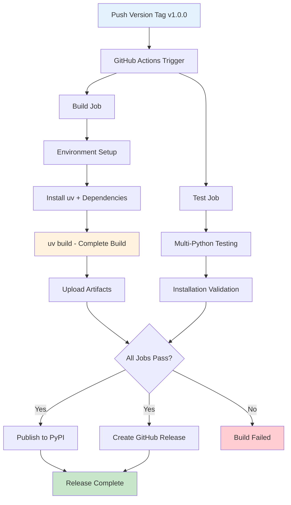

---
# Copyright (c) 2025 Vantage Compute Corporation.
layout: page
title: Release Process
permalink: /release/
---

# Release Process

This document describes the automated release process for JupyterLab Firefox Launcher, including the GitHub Actions workflow that builds, tests, and publishes the package when version tags are pushed.

## Overview

The release process is fully automated through GitHub Actions and is triggered when version tags (following the pattern `v*`) are pushed to the repository. The workflow ensures consistent, reliable releases with comprehensive testing and validation.



## Release Workflow

### Triggering a Release

The release process is triggered by pushing a version tag to the repository:

```bash
# Create and push a version tag
git tag v1.0.0
git push origin v1.0.0

# Or use the automated release script
./scripts/create_release.sh 1.0.0
```

**Tag Format Requirements:**
- Must follow the pattern `v*` (e.g., `v1.0.0`, `v2.1.3`, `v1.0.0-rc1`)
- Supports semantic versioning with pre-release identifiers
- Automatically determines if release is stable or pre-release based on version string

### GitHub Actions Workflow

The release workflow (`.github/workflows/release.yml`) consists of four main jobs that run in sequence:

#### 1. Build Job

**Purpose:** Creates the distribution packages and validates build artifacts.

**Environment Setup:**
```yaml
runs-on: ubuntu-latest
python-version: '3.11'
node-version: '18'
```

**Key Steps:**

1. **Environment Preparation**
   ```bash
   # Checkout code with full history
   git checkout --fetch-depth=0
   
   # Setup Python and Node.js environments
   python -m pip install --upgrade pip uv
   ```

2. **System Dependencies**
   ```bash
   # Install required system packages for build tools
   sudo apt-get update
   sudo apt-get install -y build-essential
   ```

3. **Complete Build Process**
   ```bash
   # Single command builds everything: frontend, backend, and packages
   uv build
   ```
   
   **What `uv build` handles automatically:**
   - Node.js dependencies installation (`yarn install`)
   - TypeScript compilation and bundling
   - JupyterLab extension build (`yarn build:prod`)
   - Python package assembly
   - Asset inclusion and shared data mapping

4. **Build Validation**
   ```bash
   # Verify build artifacts exist
   ls -la dist/
   test -n "$(find dist -name '*.whl')"
   test -n "$(find dist -name '*.tar.gz')"
   ```

**Build Outputs:**
- Python wheel (`.whl`) - Binary distribution with embedded frontend assets
- Source distribution (`.tar.gz`) - Complete source code package
- All frontend and backend components integrated automatically
- Build artifacts uploaded for use in subsequent jobs

#### 2. Test Installation Job

**Purpose:** Validates that the built packages can be installed and imported correctly across multiple Python versions.

**Testing Matrix:**
```yaml
strategy:
  matrix:
    python-version: ['3.10', '3.11', '3.12']
```

**Test Steps for Each Python Version:**

1. **Environment Setup**
   ```bash
   # Setup specific Python version
   python -m pip install --upgrade pip uv
   ```

2. **Package Installation**
   ```bash
   # Install wheel package
   uv pip install dist/*.whl
   ```

3. **Import Validation**
   ```python
   # Verify package can be imported
   import jupyterlab_firefox_launcher
   print('Package imported successfully')
   ```

**Success Criteria:**
- Package installs without errors on all supported Python versions
- All modules can be imported successfully
- No missing dependencies or runtime errors

#### 3. PyPI Publication Job

**Purpose:** Publishes the package to the Python Package Index (PyPI) for public distribution.

**Requirements:**
- Only runs if both build and test jobs succeed
- Only executes for tag pushes (not manual workflow runs)
- Uses environment protection for security

**Publication Process:**

1. **Artifact Download**
   ```bash
   # Download build artifacts from build job
   actions/download-artifact@v4
   ```

2. **Package Publishing**
   ```bash
   # Publish to PyPI using uv
   uv publish
   ```

**Authentication:**
- Uses PyPI trusted publishing for secure, token-free authentication
- Configured through PyPI project settings
- Automatic verification of package authenticity

#### 4. GitHub Release Creation Job

**Purpose:** Creates a GitHub release with the built packages as downloadable assets.

**Release Components:**

1. **Version Extraction**
   ```bash
   # Extract version from git tag
   VERSION=${GITHUB_REF#refs/tags/v}
   TAG=${GITHUB_REF#refs/tags/}
   ```

2. **Release Notes Generation**
   ```bash
   # Auto-generate release notes from CHANGELOG.md
   awk '/^## \[?'$VERSION'\]?/{flag=1; next} /^## /{flag=0} flag' CHANGELOG.md
   
   # Fallback to generic notes if no specific version found
   echo "Release $TAG" > release_notes.txt
   ```

3. **Release Creation**
   ```yaml
   # Create GitHub release with artifacts
   uses: softprops/action-gh-release@v1
   with:
     name: Release $TAG
     body_path: release_notes.txt
     files: |
       dist/*.tar.gz
       dist/*.whl
     draft: false
     prerelease: auto-detect
     generate_release_notes: true
   ```

**Release Features:**
- Automatic pre-release detection for alpha/beta/rc versions
- Both wheel and source distribution attached as assets
- Auto-generated release notes from commit history
- Manual release notes from CHANGELOG.md if available

### Success Notification

After successful completion of all jobs, a notification job provides summary information:

```bash
echo "🎉 Successfully released jupyterlab-firefox-launcher $VERSION"
echo "📦 Published to PyPI: https://pypi.org/project/jupyterlab-firefox-launcher/$VERSION/"
echo "🚀 GitHub Release: $GITHUB_SERVER_URL/$GITHUB_REPOSITORY/releases/tag/$TAG"
```

## Release Configuration

### PyPI Trusted Publishing Setup

For secure, automated PyPI publishing, the repository uses trusted publishing:

1. **PyPI Configuration:**
   - Go to PyPI project settings for `jupyterlab-firefox-launcher`
   - Add GitHub as a trusted publisher:
     - **Owner:** `vantagecompute`
     - **Repository:** `jupyterlab-firefox-launcher`
     - **Workflow:** `release.yml`
     - **Environment:** `pypi`

2. **GitHub Environment:**
   ```yaml
   environment:
     name: pypi
     url: https://pypi.org/p/jupyterlab-firefox-launcher
   ```

### Workflow Permissions

The workflow uses minimal required permissions for security:

```yaml
permissions:
  contents: write    # For creating GitHub releases
  id-token: write    # For PyPI trusted publishing
```

## Manual Release Process

If the automated workflow fails or manual intervention is needed:

### 1. Local Build and Test

```bash
# Build the package locally
uv build

# Test the built package
uv pip install dist/*.whl
python -c "import jupyterlab_firefox_launcher; print('Success')"
```

### 2. Manual PyPI Upload

```bash
# Upload to PyPI (requires authentication)
uv publish

# Or using twine as fallback
pip install twine
twine upload dist/*
```

### 3. Manual GitHub Release

```bash
# Create release using GitHub CLI
gh release create v1.0.0 dist/* \
  --title "Release v1.0.0" \
  --notes "Release notes here"
```

## Version Management

### Version Synchronization

The release script automatically synchronizes versions between files:

```python
# Update both pyproject.toml and package.json
python -c "
import json
import tomllib
import tomli_w

# Update pyproject.toml
with open('pyproject.toml', 'rb') as f:
    pyproject_data = tomllib.load(f)
pyproject_data['project']['version'] = '$NEW_VERSION'
with open('pyproject.toml', 'wb') as f:
    tomli_w.dump(pyproject_data, f)

# Update package.json
with open('package.json', 'r') as f:
    package_data = json.load(f)
package_data['version'] = '$NEW_VERSION'
with open('package.json', 'w') as f:
    json.dump(package_data, f, indent=2)
"
```

### Semantic Versioning

The project follows semantic versioning principles:

- **MAJOR** (`X.0.0`): Breaking changes, incompatible API changes
- **MINOR** (`X.Y.0`): New features, backward-compatible
- **PATCH** (`X.Y.Z`): Bug fixes, backward-compatible

**Pre-release Versions:**
- **Alpha** (`1.0.0-alpha.1`): Early development, unstable
- **Beta** (`1.0.0-beta.1`): Feature complete, testing phase
- **Release Candidate** (`1.0.0-rc.1`): Potentially final, final testing

## Release Validation

### Automated Checks

The workflow includes comprehensive validation:

1. **Build Verification**
   - Complete build process handled by `uv build` including:
     - TypeScript compilation and bundling
     - JupyterLab extension packaging
     - Python package assembly
     - Asset integration and shared data mapping
   - All required files included in distribution

2. **Installation Testing**
   - Package installs on multiple Python versions
   - All modules import successfully
   - No missing dependencies

3. **Package Integrity**
   - Wheel and source distribution created
   - Metadata correctly populated
   - File permissions appropriate

### Post-Release Verification

After release, verify the deployment:

```bash
# Test PyPI installation
pip install jupyterlab-firefox-launcher==$VERSION

# Verify GitHub release
curl -s https://api.github.com/repos/vantagecompute/jupyterlab-firefox-launcher/releases/latest

# Test in fresh environment
docker run -it python:3.11 bash -c "
  pip install jupyterlab-firefox-launcher==$VERSION && 
  python -c 'import jupyterlab_firefox_launcher; print(\"Success\")'
"
```

## Troubleshooting Releases

### Common Issues and Solutions

#### Build Failures

**Issue:** Build errors from `uv build`
```bash
# Solution: Verify dependencies and build locally with verbose output
uv build --verbose

# Check for missing system dependencies
sudo apt-get install build-essential nodejs yarn

# Clean and retry if needed
rm -rf dist/ && uv build
```

#### Test Failures

**Issue:** Import errors on specific Python versions
```bash
# Solution: Test locally with same Python version
pyenv install 3.10.0
pyenv shell 3.10.0
pip install dist/*.whl
python -c "import jupyterlab_firefox_launcher"
```

#### Publication Failures

**Issue:** PyPI authentication errors
- Verify trusted publishing configuration
- Check repository and workflow names match exactly
- Ensure environment name is correct

**Issue:** GitHub release creation fails
- Verify repository permissions
- Check tag format follows expected pattern
- Ensure artifacts were uploaded successfully

### Workflow Debugging

Enable debug logging in GitHub Actions:

```yaml
- name: Debug Information
  run: |
    echo "Tag: ${{ github.ref }}"
    echo "Version: ${{ steps.get_version.outputs.version }}"
    ls -la dist/
    python --version
    node --version
```

## Release Checklist

Before creating a release:

- [ ] All tests pass locally
- [ ] Version numbers updated in all files
- [ ] CHANGELOG.md updated with release notes
- [ ] Documentation updated if needed
- [ ] No uncommitted changes
- [ ] Branch is up to date with main

After release:

- [ ] Verify PyPI package availability
- [ ] Verify GitHub release created
- [ ] Test installation from PyPI
- [ ] Update documentation if needed
- [ ] Announce release if appropriate

## Security Considerations

### Supply Chain Security

- **Trusted Publishing:** Eliminates need for long-lived API tokens
- **Minimal Permissions:** Workflow uses least-privilege access
- **Artifact Verification:** Build artifacts validated before publication
- **Environment Protection:** PyPI publication requires environment approval

### Dependency Security

- **Pinned Dependencies:** Build uses specific, tested dependency versions
- **Security Scanning:** Automated vulnerability detection in dependencies
- **Reproducible Builds:** Consistent build environment ensures reliability

This automated release process ensures reliable, secure, and consistent package distribution while maintaining high quality standards through comprehensive testing and validation.
